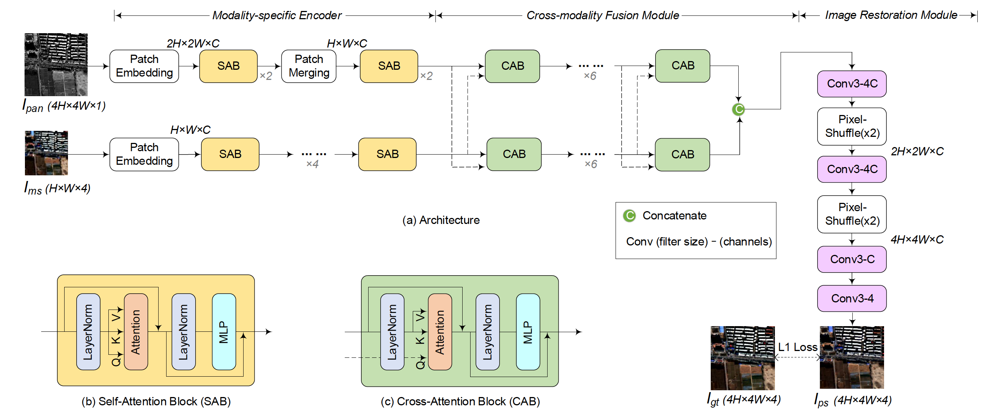

# PanFormer
This repo is the official implementation for [PanFormer: a Transformer Based Model for Pan-sharpening](https://arxiv.org/pdf/2203.02916). 
The paper is accepted to ICME2022.

## Architecture of PanFormer


# Prerequisites
This environment is mainly based on python=3.6 with CUDA=10.2

```shell
conda create -n panformer python=3.6
conda activate panformer
conda install pytorch=1.7.1 torchvision=0.2.2 cudatoolkit=10.2
pip install mmcv==1.2.7
conda install gdal=3.1.0 -c conda-forge
conda install scikit-image=0.17.2
pip install scipy==1.5.3
pip install gpustat==0.6.0
pip install numba==0.53.1 
pip install einops==0.3.0 
pip install timm==0.3.2
pip install sewar==0.4.4
```

# Test with the pretrained Model
Due to the large size of the dataset, we only provide some samples in './data' to verify the code.

```shell
conda activate panformer
export CUDA_VISIBLE_DEVICES='0';
python main.py -c configs/panformer.py
```

You can modify the config file 'configs/panformer.py' for different purposes.

# Citing PanFormer
Consider cite PanFormer in your publications if it helps your research.

```
@article{zhou2022panformer,
  title={PanFormer: a Transformer Based Model for Pan-sharpening},
  author={Zhou, Huanyu and Liu, Qingjie and Wang, Yunhong},
  booktitle={2022 IEEE International Conference on Multimedia and Expo (ICME)},
  year={2022},
  organization={IEEE}
}
```
